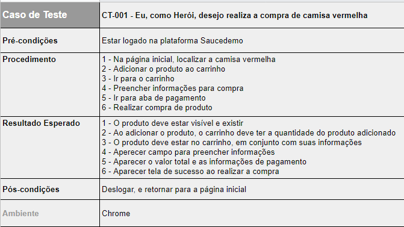
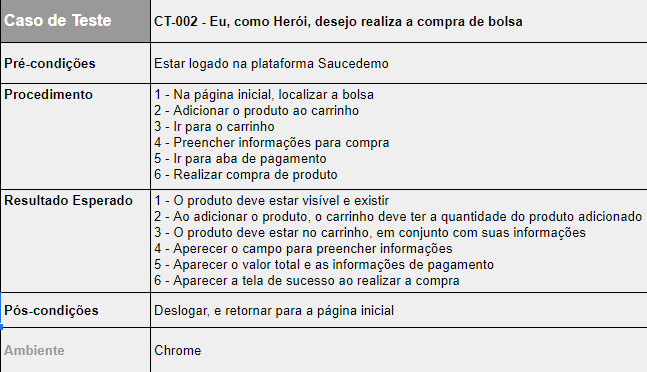
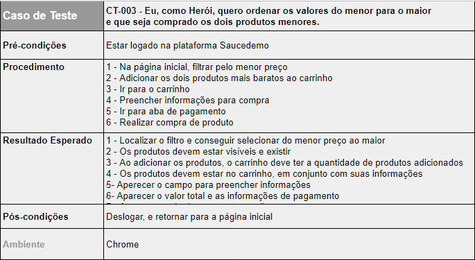

# Rotina Desafio QA

- Cypress
- Geração automática de documentação
- Padrão PageObjects

 

## Planejamento

   

   

   

 

## Manual de Uso
 

### Requisitos

- Ter nmp & yarn instalados

### Instalação

- Dentro da pasta digitar `yarn`

### Formas de inicializar

- Inicializar em conjunto com o navegador (sem gerar relatórios) `yarn run cypress open`
- Inicializar apenas pelo terminal (gerando relatórios) `yarn run cypress run` 

 

## Visualizar Documentação

### HTML
- Diretório: `cypress/reports`

### Video
- Diretório: `cypress/videos`

### Exemplo

- Projeto funcionando - [Youtube](https://youtu.be/yG-iNeFrnw8)